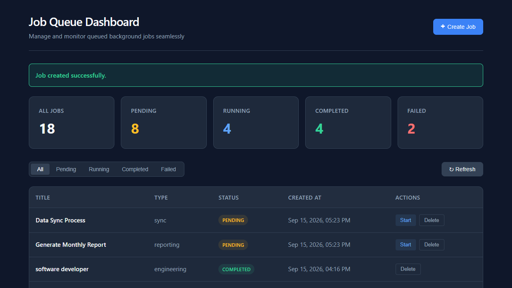
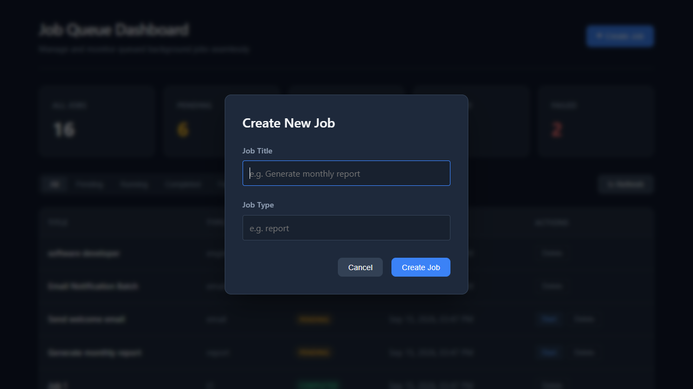
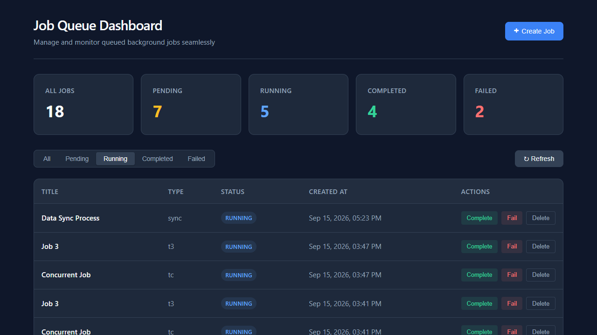
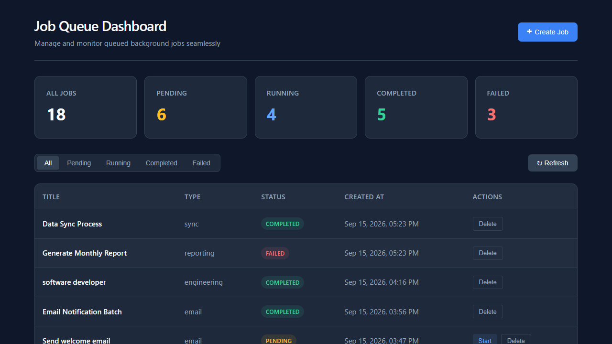
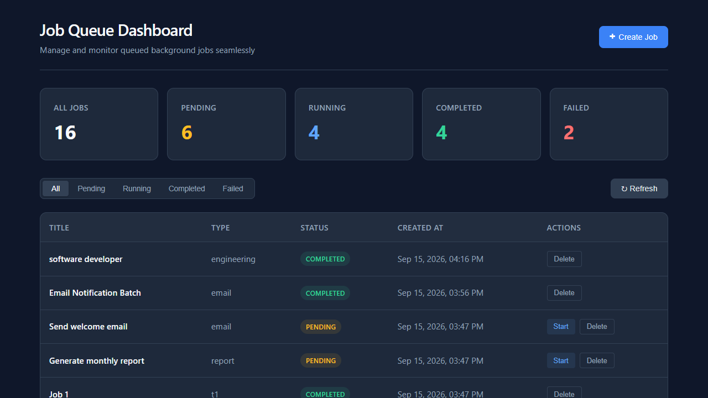

# Mini Job Queue Dashboard

A full-stack application built to manage, monitor, and transition background jobs securely and concurrently. 

This project was built focusing heavily on **clean architecture, strict validation, robust concurrency, and responsive design**. It uses NestJS and SQLite for a lightweight backend with strict validation, business-rule enforcement, and concurrency-safe state transitions.

---

## 📸 Screenshots

### Dashboard — All Jobs



### Create Job



### Running Jobs Filter



### Completed and Failed Jobs



### Empty State



---

## ✨ Features

- **End-to-end Job Management**: Create, view, update, and permanently delete background jobs.
- **Strict State Machine**: Jobs follow a strict `pending → running → completed/failed` lifecycle enforced using atomic conditional database updates.
- **Race Condition Protection**: Safe against concurrent requests manipulating the same job via atomic conditional updates (handling edge cases like double-clicks or multiple open tabs).
- **Extensive Input Validation**: Inputs are trimmed and constrained. Malformed payloads, unknown fields, and invalid UUIDs are automatically rejected.
- **Professional UI**: Responsive, minimally designed interface featuring dynamic metrics, pills, empty states, and loading overlays.

---

## 🏗 Architecture & Technology Stack

### Backend
- **Framework**: NestJS (TypeScript)
- **Database**: SQLite (via `better-sqlite3`)
- **ORM**: TypeORM
- **Validation**: `class-validator`, `class-transformer`, Global `ValidationPipe`

### Frontend
- **Framework**: React 18, Vite (TypeScript)
- **Styling**: Native CSS Variables (No Tailwind/Bootstrap)
- **State Management**: Native React Hooks (useState, useEffect, useMemo) - *Zero-dependency approach.*
- **API Client**: Native `fetch` with centralized `ApiError` interception.

---

## 📂 Folder Structure

```
.
├── backend/
│   ├── data/                 # SQLite database storage (jobs.sqlite)
│   ├── src/
│   │   ├── jobs/             # Job domain (Module, Controller, Service, Entities, DTOs)
│   │   └── common/           # Global exception filters
│   ├── test.js               # E2E scripts
│   └── render.yaml           # Deployment blueprint
└── frontend/
    ├── src/
    │   ├── components/       # Presentational components (JobRow, Modal, etc.)
    │   ├── pages/            # Page components (Dashboard)
    │   ├── services/         # API Layer (jobsApi.ts)
    │   └── types/            # Global interfaces
    └── vercel.json           # Vercel routing config
```

---

## 🚀 Setup & Execution

### Live URLs
- **Frontend**: https://airth-job-queue.vercel.app
- **Backend API**: https://airth-job-queue.onrender.com
- **Health Check**: https://airth-job-queue.onrender.com/health

### 1. Run Backend

```bash
cd backend
npm install
npm run build
npm run start
```
*The API will start on `http://localhost:3000`. It creates the database file automatically on startup.*

### 2. Run Frontend

```bash
cd frontend
npm install
npm run dev
```
*The dashboard will be available at `http://localhost:5173`.*

---

## 📡 API Documentation

### `POST /jobs`
Creates a new job. 
- **Body**: `{ "title": "string", "type": "string" }`
- **Rules**: Status is automatically locked to `pending`. Unknown fields (e.g. attempting to pass `status: "completed"`) are strictly rejected (`400 Bad Request`).

### `GET /jobs`
Returns all jobs, sorted newest first (`createdAt DESC`).

### `PATCH /jobs/:id/status`
Updates job status following strict domain transitions.
- **Body**: `{ "status": "running" | "completed" | "failed" }`
- **Conflicts**: Attempts to violate the transition matrix return `409 Conflict`.

### `DELETE /jobs/:id`
Permanently deletes a job, returning `204 No Content` on success or `404 Not Found` if the UUID doesn't exist. Malformed UUIDs return `400 Bad Request`.

---

## 🔐 Engineering Decisions & Core Mechanics

### 1. Database & Persistence
We chose `better-sqlite3` and `TypeORM` to maintain persistent state effortlessly on the filesystem without requiring a standalone database daemon (e.g., Postgres or Redis). The `jobs` entity uses UUID strings for unique identifiers.

### 2. Validation & Security
The backend acts as an absolute source of truth. The frontend is never trusted.
- `ValidationPipe` is utilized globally with `forbidNonWhitelisted: true`.
- `ParseUUIDPipe` guards ID path parameters.

### 3. Status Transition Rules
The backend enforces a strict state machine:
- `pending` → `running`
- `running` → `completed`
- `running` → `failed`
Invalid transitions immediately abort. 

### 4. Concurrency Handling (The Two-Tab Problem)
If two clients attempt to start the same pending job simultaneously, standard `SELECT -> UPDATE` patterns suffer from race conditions. 

**Solution**: This project uses atomic conditional updates directly in SQL:
```sql
UPDATE jobs SET status = 'running' WHERE id = ? AND status = 'pending';
```
If `0` rows are affected, it implies a concurrency collision (or deletion). The secondary request yields a `409 Conflict`, which the frontend cleanly catches to refresh the data grid automatically.

### 5. Trade-offs
- **Polling vs WebSockets**: Kept stateless for simplicity. The dashboard relies on manual refreshes or opportunistic refetches after mutations instead of WebSockets, decreasing infrastructure overhead.
- **No Global Store**: Bypassed Redux/Zustand entirely. Contextual prop-drilling within the Dashboard handles everything effectively.

---

## 🧪 Testing

The backend includes test scripts mapping out all API behaviors, including:
- HTTP status validations (200, 201, 204, 400, 404, 409).
- A synthetic multi-threaded `Promise.all` concurrency collision test demonstrating successful race condition deflection.

To execute tests:
```bash
cd backend
node test.js
node test-patch.js
node test-delete.js
```

---

## 🌐 Deployment

The project is natively ready for standard PaaS platforms.

- **Backend**: Can be directly deployed to **Render** using the provided `render.yaml` blueprint.
- **Frontend**: Can be directly deployed to **Vercel** using the `vercel.json` routing configuration to maintain SPA integrity.

---
*Developed for the Airth React + NestJS Intern Assignment.*
